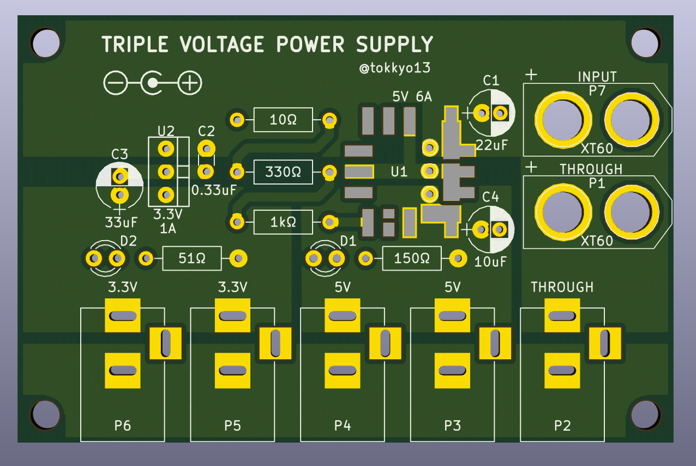
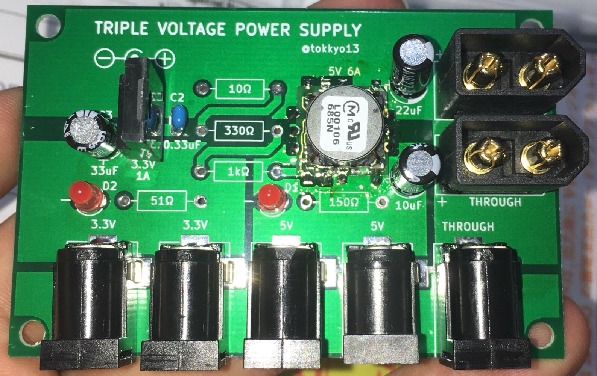
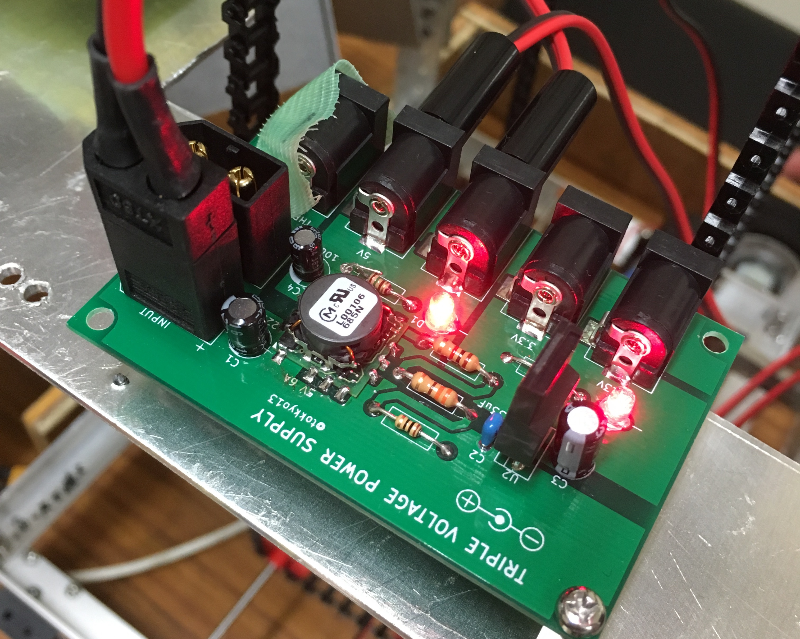

# 電源基板
## 経緯
ロボットによく使う電源をまとめて出力できる基板があると便利という話があったので作りました。

## 仕様

使っている素子の詳しいことは以下のデータシートを読みましょう。  
[OKL-T/6-W12](http://akizukidenshi.com/download/ds/murata/OKL_T6_W12.pdf)  
[TA48033S](http://akizukidenshi.com/download/ta48033s.pdf)

|コネクタ|機能|
|:-|:-|
|P1|12V出力(XT60コネクタ・オス)|
|P2|12V出力(DCコネクタ・メス)|
|P3・P4|5V出力(DCコネクタ・メス), 合計6Aまで|
|P5・P6|3.3V出力(DCコネクタ・メス), 合計1Aまで|
|P7|12V入力(XT60コネクタ・オス)|

DCDCコンバータ(U1)は表面実装なので少しはんだ付けが難しい。なので5V電源に要求される電流が少ない場合、3端子レギュレータを代わりに実装できるようにスルーホールも開けてある。

DCDCコンバータを使う場合は、10Ω, 330Ω, 1kΩの3つの抵抗の合計値を変更すれば、出力電圧を0.591V〜5.5Vの範囲で変更できる。値の変え方はデータシートに書いてある。

THROUGH端子(P1・P2)は内部的には電源入力端子と同じなので、実は電源入力端子としても使える。例えばパソコンのACアダプタをP2に繋いで5V電源を取り出したり出来る。

## 部品表
|番号|部品名|個数|備考|
|:-|:-|:-|:-|
|P1,P7|XT60オス|2|オス・メスを間違えやすいので気をつけて。ラジコンショップで売ってる|
|P2,P3,P4,P5,P6|基板取り付け用DCジャック|5|センタープラス。|
|C1|22uF, 16V|1|電解コンデンサ|
|C2|(0.33uF)|0|U2のセットに含まれてるので買わなくて良い。|
|C3|(33uF)|0|U2のセットに含まれてるので買わなくて良い。|
|C4|10uF, 16V|1|電解コンデンサ|
|D1・D2|3mm赤色LED 70° OSR5JA3Z74A|2|別にこれじゃなくてもいい。|
|U1|DCDCコンバータ OKL-T/6-W12|1|表面実装のやつ。|
|U2|TA48033S|1セット|コンデンサがセットになってるやつが秋月で売ってる。|
|抵抗|抵抗値は基板に書いてある|合計5個||

※注意：はんだ付けするときは背の低い部品からつけていくと良い。U1は最初につけるべし。

## イメージ

